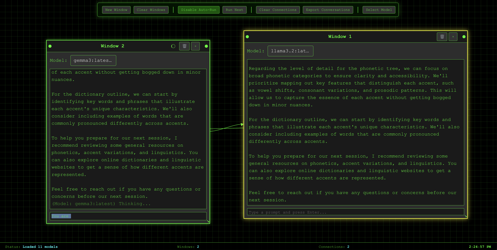

# Cybernetic Canvas (Model to Model)

A multi-window conversational AI canvas for experimenting with model-to-model workflows. Create multiple chat windows, wire them together, and pass messages between them.

## Quick start

```bash
npm install
npm run dev
```

The app uses Vite and React. By default it attempts to discover models from an Ollama server running locally. You can still use the UI without Ollama to test multi-window UX.


In a new window start the Ollama server, if it's not already running:
```bash
 ollama serve
 ```



## Features

- Multi-window chat interface
  - Create, move, resize, focus, and close windows
  - Per-window model selection
  - Clear context per window
- Connections between windows
  - Visual connections shown on a canvas
  - Drag-to-connect: start a connection from a window’s title bar connector and drop on another window to create a link
  - Auto-run: when enabled, responses from a window propagate to connected windows
- Ollama integration
  - Fetch available models at startup
  - Send prompts to per-window models
  - Per-window processing

## Recent fixes and improvements

- Fixed new windows not appearing (ID mismatch and off-screen spawn)
- CSS rework so windows render above the connector canvas and within the viewport
- Resizer stability: resize now uses captured origin position/size to remove jumpiness
- Per-window processing state to stop unrelated windows from displaying “Thinking…”

## How to use

- New Window: adds a window using the currently selected model (from the Control Panel)
- Dragging: use the window title bar to drag; use the bottom-right corner to resize
- Connect windows: hold down on the small connector hotspot in the title bar and drag to another window; release to create a connection
- Auto-Run: when enabled, a window’s response automatically pipes to any windows it connects to

## Roadmap / Remaining work

- Connection handles in the Window UI (visible ‘node’ to start a connection)
- Better connection management (delete connections via click; highlight on hover)
- Export / import conversations (JSON)
- Streamed responses and richer formatting

## Project structure

```
src/
├── components/
│   ├── ConnectorCanvas/
│   ├── Controls/
│   └── Window/
├── hooks/
├── services/
└── App.jsx
```

## Dev tips

- Window positions and sizes are managed in `useWindowManager`
- Connections live in `useConnectionManager`
- Ollama calls and per-window processing state are handled in `useOllamaAPI`
- Connector lines are drawn in `ConnectorCanvas`

## Requirements

- Node 18+
- (Optional) Ollama running locally with models installed (e.g., llama3, mistral)
